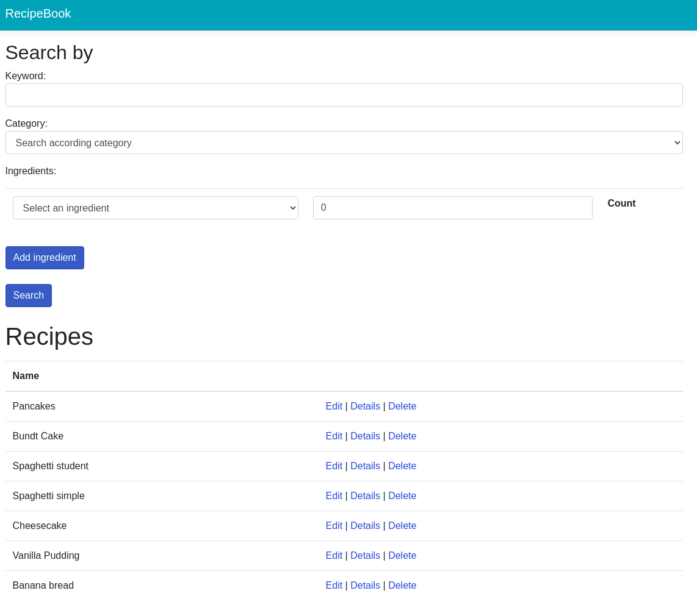
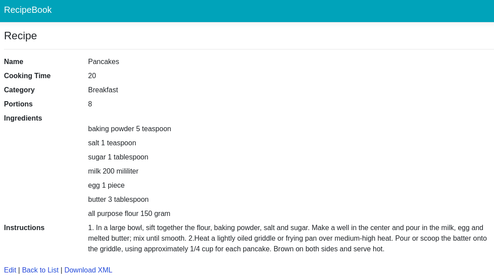
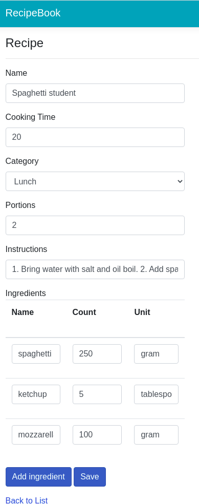
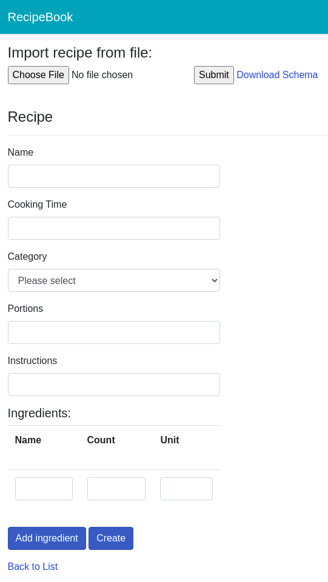

# RecipeBook
Web application for storing recipes online. Index page is shown below.

## Functionality
### Recipe filtering
Recipes can be filtered by  keyword, category or according to ingredients.
Filtering according to ingredients finds all recipes, which can be cooked from
specified ingredients. If just one ingredient is missing or not enough quantity
for some ingredient is specified, recipe is filtered out.
### Details
Detailed information about recipe is displayed. It is possible to download recipe in
XML format using button at the bottom of the page.

### Edit

### Add new recipe
You can add new recipes using the form or by importing an .xml file. Only files that are valid according to the scheme are accepted.

